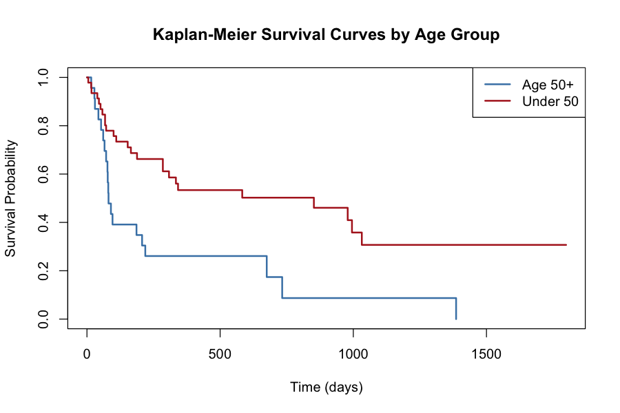

# Survival Analysis: Heart Transplant Patients by Age

**Question:** Do heart transplant patients aged 50 and older survive as long as younger patients?

**Answer:** No. Patients 50 and older had a significantly higher risk of death. Median survival was **81 days** for patients 50+ versus **852 days** for patients under 50 (log-rank p = 0.002).



## Data
Stanford heart transplant data: 69 patients, with age at transplant, survival status (1 = died, 0 = alive/censored), and survival time in days. Source: Kalbfleisch and Prentice, *The Statistical Analysis of Failure Time Data*, via the Rice University STAT 553 dataset repository. The script reads it directly from a public URL.

## Methods
1. **Data loading and checks:** the source file contains several datasets; the script reads only the 69 heart transplant rows (`skip = 11`, `nrows = 69`), names the columns explicitly, and checks the structure before analysis.
2. **Kaplan-Meier estimation:** survival curves by age group (50+ vs. under 50), with median survival and confidence intervals.
3. **Log-rank test:** tests whether the two survival curves differ.
4. **Cox proportional hazards model:** estimates the hazard ratio between age groups, with a 95% confidence interval and concordance index.

## Results
| Age group | Patients | Deaths | Median survival (days) |
|---|---|---|---|
| 50+ | 23 | 20 | 81 |
| Under 50 | 46 | 25 | 852 |

- **Hazard ratio (under 50 vs. 50+): 0.40** (95% CI 0.22 to 0.73, Wald p = 0.003): younger patients had about 60% lower risk of death at any point in time.
- **Log-rank test:** p = 0.002.
- **Concordance index:** 0.60, meaning age group alone gives modest ability to rank patients by risk.

## Limitations
- Small sample (69 patients), so confidence intervals are wide.
- Age is split at 50 for interpretability; age as a continuous variable, and other clinical factors, would give a fuller picture.
- An observational historical dataset: the association with age is not proof of cause.

## Run it
```r
install.packages("survival")  # if needed
source("survival_analysis.R")
```
